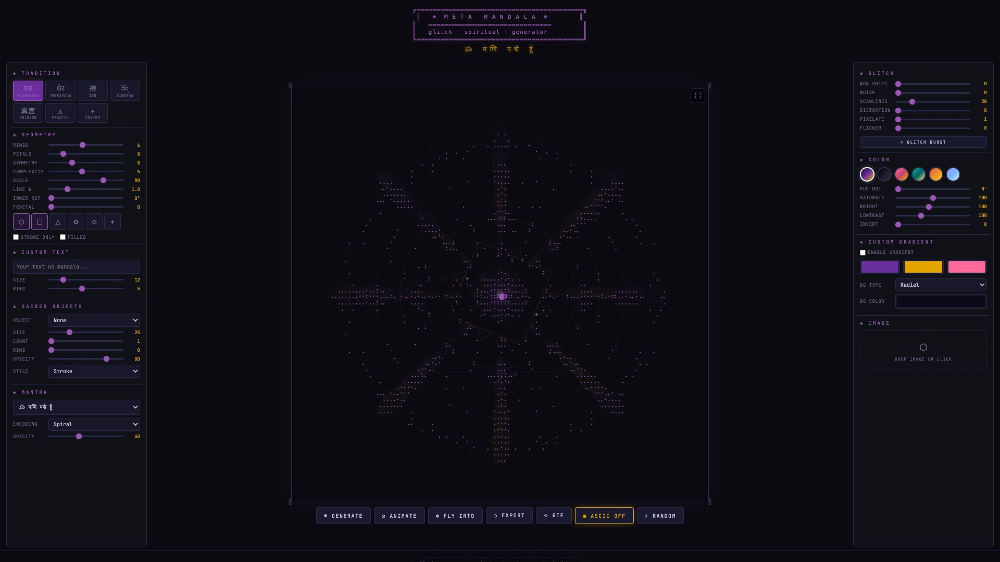
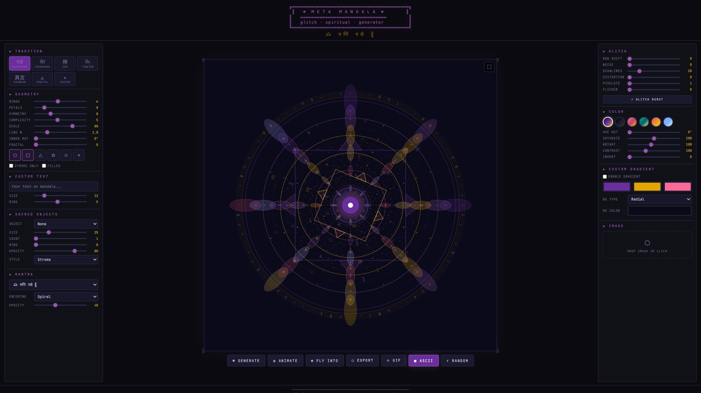
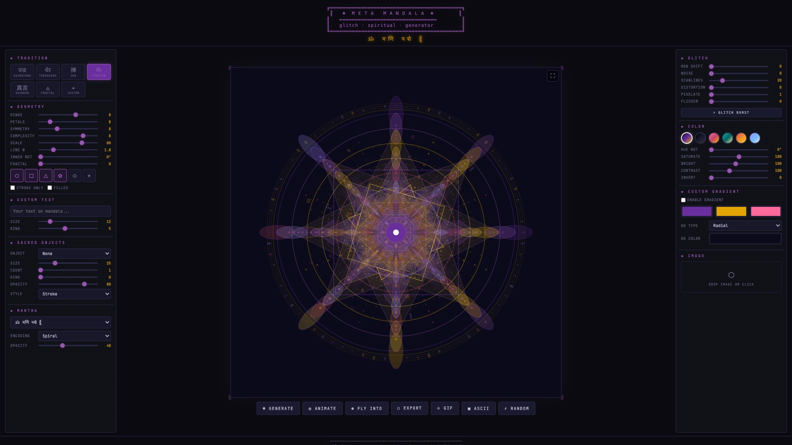
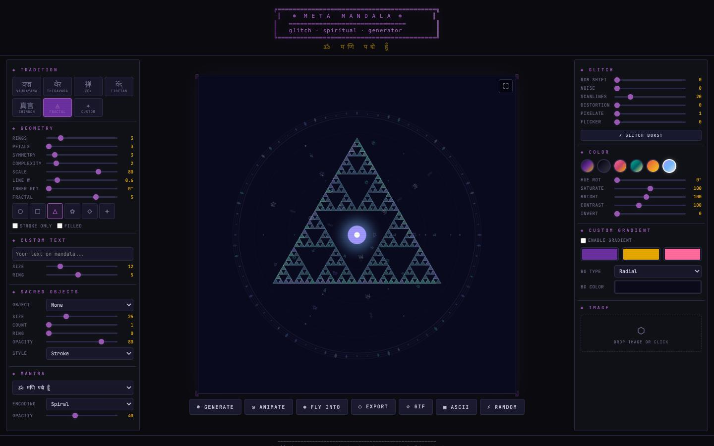
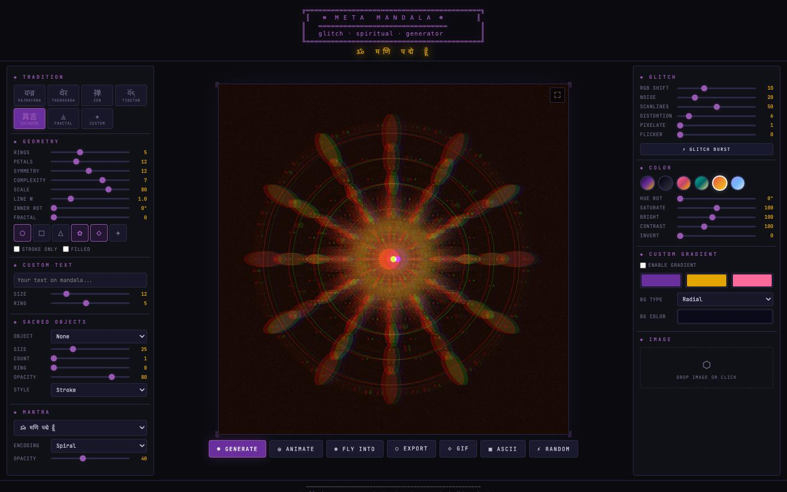
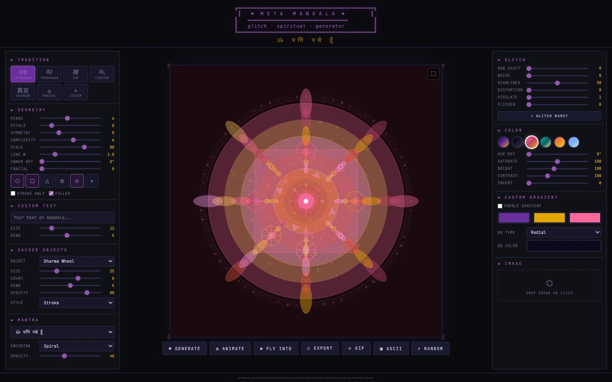

```
╔══════════════════════════════════════════════════════════════╗
║                                                              ║
║            ☸  M E T A   M A N D A L A  ☸                    ║
║            ═══════════════════════════════                    ║
║            glitch · spiritual · generator                    ║
║                                                              ║
║                      v 0 . 1                                 ║
║                                                              ║
╚══════════════════════════════════════════════════════════════╝
```

> **Procedural sacred geometry engine fused with glitch aesthetics.**
> A browser-based tool for generating, animating, and exporting mandala art
> rooted in Buddhist visual traditions — from Vajrayana symmetry to Sierpinski fractals —
> all distorted through a CRT-era digital lens.

---

## Screenshots

| Full UI with ASCII overlay | Vajrayana tradition (clean render) |
|:---:|:---:|
|  |  |

| Tibetan tradition | Fractal (Sierpinski) tradition |
|:---:|:---:|
|  |  |

| Shingon + glitch effects | Lotus palette + Dharma Wheels (filled) |
|:---:|:---:|
|  |  |

---

## What Is This

Meta Mandala is a zero-dependency, client-side sacred geometry generator. It renders
layered mandala compositions onto an HTML5 Canvas using configurable parameters: ring count,
petal geometry, symmetry axes, shape primitives, color palettes, sacred objects, mantras,
and fractal recursion depth. A secondary glitch engine applies CRT-style post-processing
(RGB channel shift, scanlines, noise, pixel distortion, flicker) on top of the clean render.
The entire pipeline runs in real-time at 60 fps in any modern browser.

No frameworks. No build step. No server required. Open `index.html` and go.

---

## Features

### Sacred Geometry Engine
- **7 Buddhist traditions** with unique geometry presets: Vajrayana, Theravada, Zen, Tibetan, Shingon, Fractal, Custom
- **6 shape primitives**: circle, square, triangle, lotus petal, diamond, star — freely combinable
- **Configurable geometry**: rings (1-12), petals (3-32), symmetry axes (1-24), complexity layers (1-10)
- **Sierpinski fractal mode** with recursion depth up to 7 levels
- **Inner ring rotation** for asymmetric compositions
- **Stroke / Filled rendering modes** with per-ring gradient fills
- **Procedural seed system** — every mandala is deterministically reproducible

### Sacred Objects
10 hand-drawn vector objects rendered directly on canvas:
Buddha, Third Eye, Dharma Wheel, Deer, Elephant, Stupa, Vajra, Bodhi Tree, Moon, Om.
Each configurable by count (1-12), size, placement ring, opacity, and render style (stroke / fill / glow).

### Mantras
6 built-in sacred texts (Devanagari, CJK) + custom input.
4 encoding modes control how text integrates with the geometry:
**Spiral** (text follows logarithmic spiral), **Radial** (concentric rings of characters),
**Hidden** (low-opacity ambient overlay), **Glitch** (pseudo-random scatter with seeded positioning).

### Glitch Post-Processing
Real-time pixel-level effects applied via a second canvas layer:
- **RGB Shift** — chromatic aberration via per-channel horizontal displacement
- **Noise** — random luminance perturbation with density control
- **Scanlines** — horizontal CRT raster line simulation
- **Distortion** — sine-wave horizontal pixel displacement (animated)
- **Pixelate** — resolution reduction with nearest-neighbor scaling
- **Flicker** — random brightness/blackout bursts
- **Glitch Burst** — triple-stacked random parameter spike for instant chaos

### Color System
- **6 curated palettes**: Samsara, Void, Lotus, Dharma, Fire, Ice
- **Full color correction**: hue rotation, saturation, brightness, contrast, invert
- **Custom 3-stop gradient** with flat / radial / linear / conic background types

### Image Integration
- Drag-and-drop any image into the mandala as a texture source
- **Kaleidoscope fragmentation** (2-36 segments) with per-fragment rotation
- **11 blend modes**: Normal, Multiply, Screen, Overlay, Difference, Exclusion, Luminosity, Hard Light, Soft Light, Dodge, Burn
- **Edge detection** (Sobel operator) and **threshold** filters applied pre-fragmentation
- Mirror modes: None, Alternate, All

### Animation
- **Rotate** — continuous smooth canvas-space rotation with synchronized glitch
- **Fly Into** — procedural zoom tunnel with multi-layer parallax, fade-in/out lifecycle, and auto-respawning layers

### ASCII Mode
Real-time brightness-mapped ASCII art overlay. The entire 800x800 canvas is sampled
into a 120-column character grid using an 11-step luminance ramp (` .·:;+*%#@█`).
Auto-scales font size to fill the canvas frame at any viewport dimension.

### Export
- **PNG** at 5 resolutions: 800px, 1024px, 2K, 4K, 4096px — rendered via offscreen canvas with full glitch pipeline
- **GIF** — custom LZW encoder with median-cut 256-color quantization, configurable duration / FPS / rotation speed
- **WebM** — MediaRecorder-based video capture with VP9 codec at 5 Mbps

### Custom Text
Arbitrary text rendered along any ring of the mandala with configurable font size and placement.

### Keyboard Shortcuts
| Key | Action |
|---|---|
| `G` | Generate new mandala |
| `R` | Full random parameters |
| `E` | Export dialog |
| `A` | Toggle ASCII overlay |
| `F` | Fullscreen |
| `Space` | Start/stop animation |
| `Esc` | Close modals |

---

## Tech Stack

| Layer | Technology |
|---|---|
| Rendering | HTML5 Canvas 2D API (dual-canvas architecture) |
| Glitch pipeline | Raw `ImageData` pixel manipulation |
| GIF encoder | Custom LZW compressor with in-browser quantization |
| Video export | MediaRecorder API (VP9/WebM) |
| UI | Vanilla HTML/CSS/JS, JetBrains Mono font |
| Dev dependency | Puppeteer (screenshot automation only) |

**Zero runtime dependencies.** Total payload: ~50 KB (uncompressed JS + CSS + HTML).

---

## Quick Start

```bash
# No install needed — just open in a browser
open index.html

# Or serve locally
python3 -m http.server 8080
# then navigate to http://localhost:8080
```

---

## Project Structure

```
META_MANDALA/
├── index.html              — UI layout, controls, modals
├── style.css               — dark theme, panels, responsive grid
├── engine.js               — MandalaEngine: geometry, palettes, traditions, sacred objects, mantras
├── glitch.js               — GlitchEngine: RGB shift, noise, scanlines, distortion, pixelate, flicker
├── gif.js                  — GIFEncoder (LZW) + VideoExporter (MediaRecorder)
├── app.js                  — event wiring, animation loops, export orchestration
├── capture-screenshots.js  — Puppeteer automation for README screenshots
├── screenshots/            — pre-rendered screenshots for documentation
└── package.json            — dev dependencies (puppeteer)
```

---

## Versioning

Meta Mandala follows [Semantic Versioning](https://semver.org/) (SemVer):

```
MAJOR.MINOR.PATCH
  │     │     └── bug fixes, polish, no API changes
  │     └──────── new features, backward-compatible
  └────────────── breaking changes, architectural shifts
```

### Current Version: `0.1.0`

The `0.x` series is the **initial development phase**. The public API (parameter structure,
export formats, engine interface) is not yet stabilized. Expect changes between minor
versions during this phase.

### Roadmap

| Version | Milestone |
|---|---|
| **0.1** | Core engine: geometry, traditions, glitch, export (PNG/GIF/WebM), ASCII mode, sacred objects, mantras. **← you are here** |
| **0.2** | Preset save/load system. Undo/redo history. Parameter sharing via URL hash. |
| **0.3** | Audio reactivity (Web Audio API). Beat-synced animation and glitch triggers. |
| **0.4** | SVG export. Layer compositing with independent transforms per ring. |
| **0.5** | Community preset gallery. Import/export JSON configurations. |
| **1.0** | Stable API. Documentation. Plugin architecture for custom shape and effect modules. |

### Changelog

#### v0.1.0 — Initial Release

- Procedural mandala engine with 7 tradition presets
- 6 geometric primitives (circle, square, triangle, lotus, diamond, star)
- Sierpinski fractal generation with configurable recursion depth
- 10 sacred objects with placement, styling, and opacity controls
- 6 mantra texts with 4 encoding modes (spiral, radial, hidden, glitch)
- Real-time glitch post-processing: RGB shift, noise, scanlines, distortion, pixelate, flicker
- 6 color palettes + full color correction + custom 3-stop gradient backgrounds
- Image integration with kaleidoscope, blend modes, edge detection, thresholding
- Dual animation modes: continuous rotation and fly-into tunnel
- ASCII art overlay with auto-scaling character grid
- Hi-res PNG export (up to 4096px)
- Animated GIF export with custom LZW encoder
- WebM video export via MediaRecorder API
- Custom text rendering along mandala rings
- Keyboard shortcuts for all primary actions
- Responsive three-panel UI with JetBrains Mono typography
- CRT scanline overlay for ambient aesthetic

---

<p align="center">
<code>☸ all phenomena are empty ☸ gate gate paragate bodhi svaha ☸</code>
</p>
